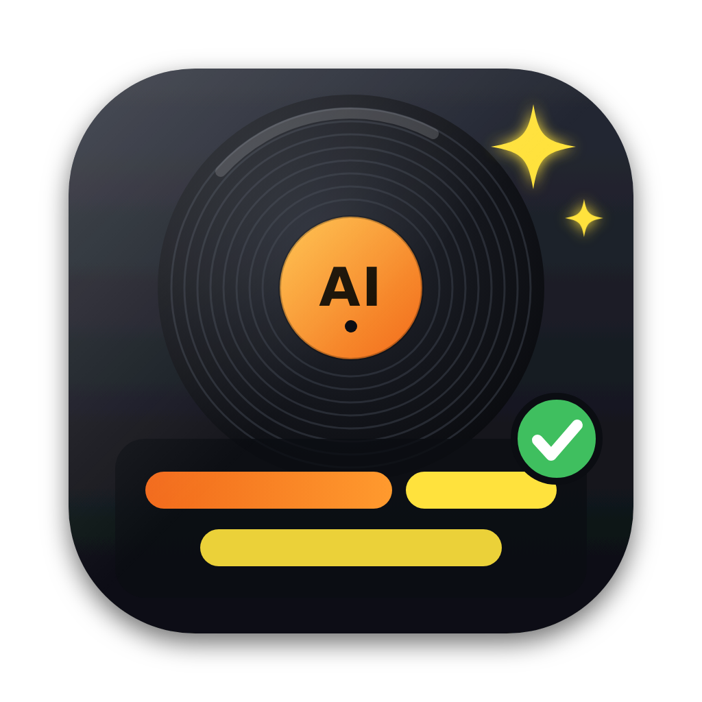

  

# AI-LYRICS-FIX FOR VIRTUAL DJ

**Corrige les paroles karaoké générées par l'IA de VirtualDJ avec les paroles de LRCLIB, en gardant le timing.**
**Fixes VirtualDJ's AI-generated karaoke lyrics with LRCLIB lyrics, keeping the word timing.**

  <a href="https://github.com/owfrappier/AI-LYRICS-FIX-FOR-VIRTUAL-DJ/releases/latest"><b>⬇️ Télécharger / Download</b></a>
  &nbsp;·&nbsp;
  <a href="#-français">🇫🇷 Français</a>
  &nbsp;·&nbsp;
  <a href="#-english">🇬🇧 English</a>
  &nbsp;·&nbsp;
  <a href="https://www.paypal.com/paypalme/owfrappier">♥ Donate</a>

| Système / System | Fichier / File |
|---|---|
| macOS (Apple Silicon, 11+) | `…-macOS-AppleSilicon.pkg` — signé et notarisé Apple / Apple signed & notarized |
| Windows 10/11 (x64) | `…-Windows-x64.zip` — décompresser et lancer l'`.exe` / unzip and run the `.exe` |

---

## 🇫🇷 Français

### Ce que fait l'app

- Liste tous vos morceaux qui ont des paroles dans VirtualDJ (`extra.db`), avec artiste et titre.
- Cherche automatiquement les paroles sur **LRCLIB** (titre, artiste, durée).
- **LRC Sync** : recale les paroles LRCLIB sur le timing mot à mot de VirtualDJ, même quand la reconnaissance
  IA est très fausse ou que votre version a une intro différente (décalage détecté automatiquement).
- Modes **Smart**, **Hard** (langues rares, ex. corse) et **Manuel** (édition directe, calage au clavier
  pendant l'écoute avec la touche **T**).
- **Pages karaoké** comme sur l'écran VirtualDJ (un point toutes les N lignes).
- Aperçu karaoké avec l'audio du morceau.
- Écriture sûre : sauvegarde automatique d'`extra.db` avant chaque modification, VirtualDJ fermé puis
  relancé automatiquement.

### Utilisation

1. Lancer l'app : elle trouve le dossier VirtualDJ (sinon bouton **Dossier VirtualDJ…** → choisir `extra.db`).
2. Cliquer un morceau : les paroles LRCLIB sont chargées et alignées.
3. Onglet **2** : vérifier, écouter, corriger.
4. Onglet **3** : **Écrire dans extra.db**.

Les sauvegardes sont dans `VirtualDJ/AI-LYRICS-FIX-Backups/` (les 30 dernières).

### Installation

- **macOS** : ouvrir le `.pkg`, l'app s'installe dans *Applications*. Au premier « Écrire », macOS demande
  l'autorisation de contrôler VirtualDJ (pour le fermer et le relancer).
- **Windows** : décompresser le `.zip` et lancer l'`.exe`. Au premier lancement, SmartScreen peut afficher
  « Windows a protégé votre ordinateur » : cliquer **Informations complémentaires › Exécuter quand même**
  (l'exe n'est pas encore signé).

---

## 🇬🇧 English

### What it does

- Lists every song that has lyrics in VirtualDJ (`extra.db`), with artist and title.
- Automatically searches **LRCLIB** for the lyrics (title, artist, duration).
- **LRC Sync**: aligns the LRCLIB lyrics on VirtualDJ's word-by-word timing, even when the AI recognition
  is badly wrong or your version has a different intro (offset detected automatically).
- **Smart**, **Hard** (rare languages, e.g. Corsican) and **Manual** modes (direct editing, tap-to-sync
  with the **T** key while listening).
- **Karaoke pages** like on the VirtualDJ screen (a full stop every N lines).
- Karaoke preview with the song's audio.
- Safe writing: automatic backup of `extra.db` before every change, VirtualDJ closed and relaunched
  automatically.

### How to use

1. Launch the app: it finds your VirtualDJ folder (otherwise **Dossier VirtualDJ…** button → pick `extra.db`).
2. Click a song: the LRCLIB lyrics are loaded and aligned.
3. Tab **2**: check, listen, fix.
4. Tab **3**: **Écrire dans extra.db** (write to extra.db).

Backups are stored in `VirtualDJ/AI-LYRICS-FIX-Backups/` (last 30 kept).
*The interface is in French for now.*

### Installation

- **macOS**: open the `.pkg`, the app is installed in *Applications*. On the first write, macOS asks for
  permission to control VirtualDJ (to quit and relaunch it).
- **Windows**: unzip and run the `.exe`. On first launch SmartScreen may show "Windows protected your PC":
  click **More info › Run anyway** (the exe is not code-signed yet).

---

## ♥ Soutenir le projet / Support the project

Si l'app vous rend service / If the app helps you: **[Donate (PayPal)](https://www.paypal.com/paypalme/owfrappier)**

---

Olivier W. Frappier — logiciel gratuit, code source non public / free software, source code not public.
Non affilié à VirtualDJ / Atomix Productions — not affiliated with VirtualDJ / Atomix Productions.
Paroles fournies par / lyrics provided by [LRCLIB](https://lrclib.net).
Gardez toujours vos propres sauvegardes / always keep your own backups.
